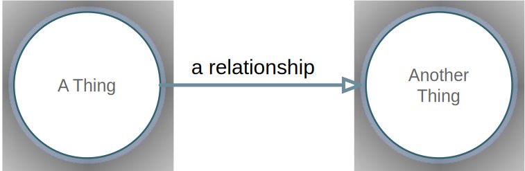
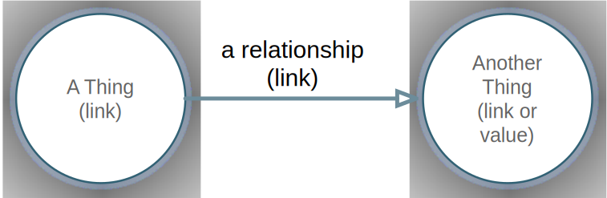
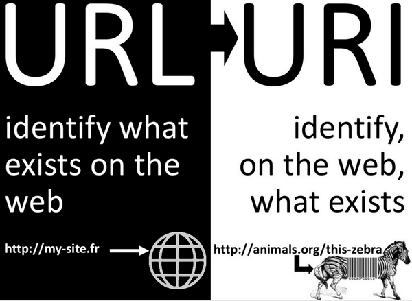
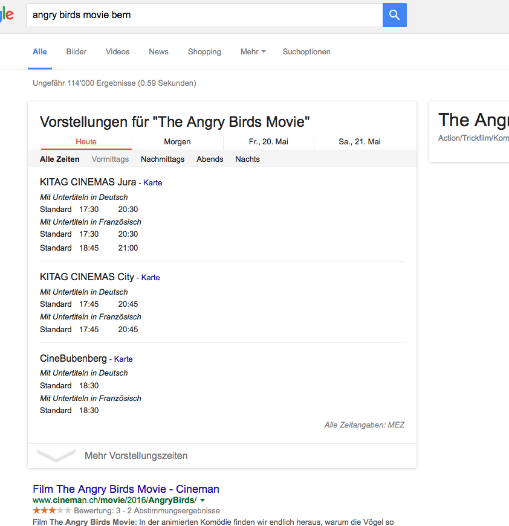

count: false
class: center, middle

# Linked Data Basics

> There is no spoon

[Zazuko GmbH](http://www.zazuko.com/)

This work is licensed under a

[Creative Commons Attribution-ShareAlike 4.0 International License](https://creativecommons.org/licenses/by/4.0/)


---

background-image: url(../img/web_documents.png)

# Web of Documents

---

# Web of Documents

* Since the 90ies
* Link (URL) for each site
* A site typically represents a document
* Links to other pages
* For humans

---

background-image: url(../img/web_url.png)

# URL as unique identifier

---

# URL as unique identifier

* We enter the URL by hand
* Use a search engine
* Or follow links within documents
* The links are not typed
* so we don't know what the relation is to the current document

---

background-image: url(../img/proposal.gif)

# Who invented it?

---

# Who invented it?

* Internet exists already since the late 70ies (TCP/IP stack)
* Mail (SMTP) since 1981
* It did have growth over time but not that fast

---

background-image: url(../img/Evolution.png)

# The Web

---

# The Web

* With the Web came exponential growth
* Thanks to the hyperlink (and hypertext/HTML)

---

background-image: url(../img/web_documents.png)

# So far so good

---

background-image: url(../img/China-News.png)

# Do you speak Chinese?

---

# Do you speak Chinese?

* Semantics of a page is understandable for (non visually impaired) people,
* as long as I know the script, language and domain

---

background-image: url(../img/SBB_Delay.png)

# Semantics is hard for machines

---

background-image: url(../img/SBB_Teilausfall_Google.png)

# For example Google

---

# For example Google

* Semantics is hard for machines
* Context is often completely missing
* Example: Jaguar the animal, the car or the MacOS 10.2 Release?

---

background-image: url(../img/Pieter_Bruegel-Tower_Of_Babel.jpg)

# Confusion of tongues (confusio linguarum)

---

# Everything is going to be alright with databases?

* Data in silos
* Partially available on the Web
* Confusion of tongues between databases
* Technically as well as with regard to contents (semantics)
* You cannot search and/or link across databases/datasets

---

# How about centralized data management?

Not realistic:
* There is no single source of truth
* Does not reflect federal and pluralistic structures
* Even rarely works in centralized systems
* Inherent barriers in regards to scalability
* Ambitious, technically and with regards to content 

---

# Decentralized approach

Requirements?
* A common exchange format
* Semantics has to be part of the data
* Multilingualism in its core
* One can express any relationship between entities
* Even across data sets and silos
* Decentralized data management/maintenance
* Queries across data sets/silos are possible

---

background-image: url(../img/Things.jpg)

# Try this!

---

# Linked Data as approach

* RDF as common data model
* Well-known schemas & ontologies as Lingua Franca
* Web (HTTP) as transport
* Links (URIs) as (decentralized) identifiers
* Multilingualism in its core
* SPARQL as standardized query language
* "Agile" data model

---

background-image: url(../img/METROPOLIS_machine.jpg)

# Machine-readability

---

# Data model



---

# RDF data model



---

# RDF data model

* Instead of a document I describe a single information

Example:

```turtle
<ktk> <givenName> "Adrian"
<ktk> <familyName> "Gschwend"
```

---

# The difference to the previous Web



---

background-image: url(../img/TheFarSide-ClearUpThings.jpg)

---

# Technology stack

* W3C standard, as the Web itself
* SPARQL as query language
* Implementation of the stack in all common programming languages

---

# SPARQL

* It’s a real standard & vendors respect it
* W3C standard
* Query language for Linked Data
* Scales (in memory)
* Supports Federated Queries
* Commercial vendors, growing marked
* Open Source alternatives

---

# SPARQL Basics

* At home: [SPARQL in 11 minutes](https://www.youtube.com/watch?v=FvGndkpa4K0)
* SELECT for selection, WHERE for conditions
* WHERE typically combines multiple conditions 
* In SQL this would be a JOIN
* Without the headache you get by using JOIN
* See sample queries in the SPARQL presentation

---

# Benefits

* Re-use data outside of its initial use case
* Data is published in the domain of the data owner (like a website)
* Access is visible (logging)
* Complex queries are possible by using SPARQL
* ➞ Answers as CSV, XML, JSON, RDF
* the data is the API
* ➞ Answers in Text, XML, JSON
* no problems like API versioning & maintenance (API hell)

---

# Conclusion

* Web of Data instead Web of Documents
* Same technology stack
* Open standards
* Semantical interoperability through vocabularies & ontologies
* Decentralized, as the web
* Web Scale Database

Built on an agile data model

---

background-image: url(../img/Scrum.png)

---

# The Semantic Web & Linked Data

Another used term is "The Semantic Web"

> The Semantic Web isn't just about putting data on the web. It is about making links, so that a person or machine can explore the web of data.  With linked data, when you have some of it, you can find other, related, data.

Tim Berners-Lee, [Linked Data](https://www.w3.org/DesignIssues/LinkedData.html) (2006)

---

background-image: url(../img/LinkedOpenDataCloud2014.svg)

# Linked Open Data Cloud

---

# Linked Open Data Cloud

* See [lod-cloud.net](http://lod-cloud.net/)
* Contains the biggest public Linked Open Data repositories
* Linked Open Vocabularies [LOV](http://lov.okfn.org/dataset/lov/) for common vocabularies
* [Prefix.cc](http://prefix.cc/) for prefixes & shortcuts

---

# Wikidata

* Wikipedia for raw data
* Looong story around/against RDF & Linked Data
* Now with SPARQL endpoint!
* Prefix: `http://www.wikidata.org/entity/Qxyz` for Linked Data
* Example query for airport codes & labels: https://t.co/gyWQ7MRzL6
* Also supports [geospatial queries](http://addshore.com/2016/05/geospatial-search-for-wikidata-query-service/)
* Lots of cool new stuff every month!

---

# Google search

* SEO, search engine optimization
* Today via schema.org
* Completely Linked Data
* JSON-LD or RDFa serialization



---

background-image: url(../img/movie-google.png)

---

# To finish with The Matrix

> _Boy:_ Do not try and bend the spoon. That's impossible. Instead... only try to realize the truth.<br/>
> _Neo:_ What truth?<br/>
> _Boy:_ There is no spoon.

[YouTube](https://www.youtube.com/watch?v=uAXtO5dMqEI)

---

background-image: url(../img/metropolis-5.jpg)

# Thanks! Questions?
