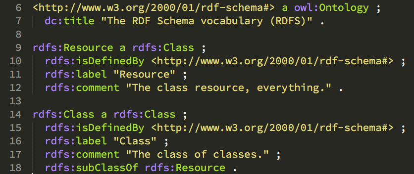

class: center, middle

# RDF Schema, OWL and the meaning of life

> You know nothing, Jon Snow

[Zazuko GmbH](http://www.zazuko.com/)

This work is licensed under a

[Creative Commons Attribution-ShareAlike 4.0 International License](https://creativecommons.org/licenses/by/4.0/)

---

background-image: url(../img/Pieter_Bruegel-Tower_Of_Babel.jpg)

## Confusion of tongues (confusio linguarum)

---

## What can we do about it?

* We need to share our interpretation of the world
* Use the web for it
* There will be conflicting definitions of similar or same things
* But that is the reality
* We will (have to) clean up the mess one step at a time

---

## Use the web, but how?

* We use RDF itself
* Unlike most other data models, there is no difference between data & schema
* Both is defined and published/consumed the same way
* We need to bootstrap a schema in RDF itself
* Let us have a look at the basics

---

## Basic Vocabulary

* RDF 1.0: 2004, RDF 1.1: 2014
* rdf: Bootstrapping, `Property`, `type`, ...
* rdfs: `Resource`, `Class`, `Literal`, `subClassOf`, `subPropertyOf`, ...
* Provides everything needed for basic schemas

---

## RDF & RDF Schema

* Provides the basics necessary to bootstrap the RDF world
* Creates interesting definitions, like: 

See the definition in the [specification](https://www.w3.org/TR/rdf-schema/#ch_resource)

---

## Don't panic!

* This is perfectly fine
* Looks super confusing in the begining, starts to get easier over time
* Especially once we start to do reasoning as well
* Just use the basics you understand
* It is easy to make things more complicated later, if really necessary
* Do not copy/paste from other vocabularies unless you know what you are doing

---

## Example: RDF Schema based Class

Further reading: RDF 1.1 Primer, [RDF Vocabularies](https://www.w3.org/TR/rdf11-primer/#section-vocabulary)

* A class should denote a "thing"

---

## OWL

* Web Ontology Language (OWL)
* Started 2004, OWL2 in 2009
* Feels like OO-Programming (but different)
* Greatly extends expressiveness of RDFS
* Ontologies consists of a set of axioms on classes

---

## Vocabulary vs. Schema vs. Ontology

* Schemas are a set of 'types', each associated with a set of properties
* Schemas are mostly RDFS based, minimal if any OWL vocabulary in it
* A bunch of definitions, typically within a specific domain, is often called a vocabulary
* "A vocabulary" shares namespace and formal definitions (see W3C schemas)
* When one is using expressiveness of OWL it is called an ontology
* This is our point of view, you might get different definitions

---

## SKOS

* Simple Knowledge Organization System SKOS
* Use [SKOS](http://www.w3.org/2004/02/skos/) for controlled vocabularies like
    -  thesauri
    -  classification schemes
    -  taxonomies
    -  subject-heading systems
* You can create a "concept" without the need to create your own class for it
* There are many tools available for maintaining SKOS based controlled vocabularies

---

## SHACL & ShEx

* Shapes Constraint Language ([SHACL](https://www.w3.org/TR/shacl/))
* Shape Expressions ([ShEx](http://shex.io/))
* Describe the "shape" of your data
* Not the same but partially overlapping with OWL
* We would choose this for data validation before we define OWL constraints
* At least SHACL can be validated through SPARQL

---

## Do I need any of this?

* Not really
* It is more best practices than required
* I do not have to provide any schema before I can start creating RDF
* That would be impossible in the relational world
* This is called the "Open World Assumption"

---

## Open World Assumption

> The closed world assumption implies that everything we don’t know is false, while the open world assumption states that everything we don’t know is undefined.

Semantic Web technologies use the open world assumption. Under the open world assumption, if a statement cannot be proven to be true with current knowledge, we cannot draw the conclusion that the statement is false.

Or: Everything is permitted until it is prohibited.

See [here](http://www.mkbergman.com/852/the-open-world-assumption-elephant-in-the-room/) or [here](http://www.dataversity.net/introduction-to-open-world-assumption-vs-closed-world-assumption/) for more explanation.

---

## How is it used?

The beginnings of Semantic Web:

* RDF & RDFS
    - Basic vocabs in RDFS
    - People want validation of RDF data
    - Lacks expressiveness
    - Therefor OWL was created
* OWL
    - There is OWL!
    - Remember the 90ies were not far away
    - Let us model the world!
    - Everyone goes back to OO/SQL mode and spends the next X months modeling an ontology with 2000 classes and x-times that properties
    - Remember those fully normalized SQL databases where there are only 10% of the tables filled with data

---

## What happened

* No one gets anything done within this time,
* no one will ever use and/or understand the complete ontology
 
You can still find many such ontologies in the web.

Many people jumped the boat at this time, this is the first phase of frustrated RDF users. You will cross them from time to time.

---

## Fast forward to 2011: schema.org

* Search engines want Search Engine Optimization (SEO)
* Microdata hits limitations
* Common understanding of basic terms necessary ("Vocabulary")
* Google hires [Dan Brickly](http://danbri.org/) (one of the early RDF gods, Mr. "foaf")
* Dan creates schema.org, in collaboration with other search engines
* Looks like RDF but was at this point not machine-readable RDF
* RDF community was not happy (me [included](http://strangelove.netlabs.org/2011/06/schema-org-not-too-impressive/))

---

## schema.org development process

See [How We Work](http://schema.org/docs/howwework.html) for details

* Started with absolute basics
* Permanent work-in-progress
* Regular releases
* No versioning in namespace!
* Things that did not work out get deprecated instead
* Later switched to "real" RDF
* Maintained in [Github repository](https://github.com/schemaorg/schemaorg)
* Clearly defined, open process (Github issues, mailing lists, subgroups etc.)

---

## schema.org 6 years later

* Extremely successful project
* Web developers stated providing RDF (RDFa or JSON-LD)
* Vivid community, constant enhancements
* Tons of machine readable data on the "classical" web
* Examples: Cinema, opening hours, hotel booking, product search etc.

---

## W3C & Semantic Web today

* W3C Community Groups often start discussions
* Working Groups work on a specific new recommendation
* In many cases way more pragmatic than a decade ago
* Small, well documented vocabularies got developed within the past few years
* After all we saw what worked and what did not work in the past

---

## Lessons learned

* schema.org might have a different goal but their pragmatic approach is very successful
* Start small. Don't worry too much about schema initially
    - Search for existing definitions on sites like [Linked Open Vocabularies (LOV)](http://lov.okfn.org/dataset/lov/)
    - You can and even should mix classes and properties from various schemas
    - Take what fits best
    - If you can't find anything, create an ad-hoc schema for your organization
    - Once you have experience with the data, formalize it
* Above everything, start creating data and automate it in pipelines
* Write SPARQL queries to get a feeling for your data and model

---

## Evaluating schemas

* Zazuko evaluated many schemas for many domains within multiple projects
* There is good stuff available, ask us if you need advice
* Latest developments
    - spatial data
    - Internet of Things (IoT)
    - IoT domain is still work-in-progress, multiple competing standards

---

## Maintaining your own schema

* Start small. A Turtle file in a Git repository might be more than enough for a start
* Open World Assumption: Restrict what you have to restrict, not more
* Use tools like [protégé](http://protege.stanford.edu/) and [TopBraid Composer](http://www.topquadrant.com/tools/ide-topbraid-composer-maestro-edition/) wisely
* Release new versions when needed, deprecate things that did not work out
* Do not do any versioning in the namespace

---

## Validation

* Validate your data amongst RDF & XSD constraints
* Use tools like `riot`
* Only after that load it to triplestore
* Use SHACL and/or ShEx for basic validation of shape
* Stardog also provides [Stardog Integrity Constraint Validation (ICV)](http://www.stardog.com/docs/#_validating_constraints)

---

## Reasoning Types

* [SPARQL 1.1 Entailment Regimes ](http://www.w3.org/TR/sparql11-entailment/)
    - Extend basic graph pattern evaluation to what is defined in RDF, RDFS, OWL2 etc.
    - Depending on your use case, that can be very useful
    - Interprets properly written schemas (subClassOf, subPropertyOf etc.)
    - Basic ontology mapping
* Reasoning
    - Similar, usually provides additional support for "rules" languages
    - Obviously OWL2 profiles
    - Example: [SWRL](http://www.w3.org/Submission/SWRL/) or better: [Stardog Rules Syntax](http://www.stardog.com/docs/#_stardog_rules_syntax)

---

## When to use reasoning

* Depends on the use case
* Can be used for data cleaning
* Or data validation
* Or querying over diverse data sets and schemas
* ...

But it is in general more fun once data fulfills some minimal quality standards

---

## Open World Assumption

* Remember the benefits of RDF as an agile data model
* Do not make your life complex before you have a good reason to do so
* Grow complexity with your data, when necessary
* Otherwise you are back to RDBMS problems
* Implement APIs & frontend code in an agile way as well, your data and schema will most definitely change

---

## Zazuko Experience

* Participation in schema.org effort
* Evaluation of existing schemas and ontologies
* Creation of schema.org like ontologies (gont, for Swiss government)
* Review of ontologies for customers

---

## Books / References

* W3C [OWL 2 Web Ontology Language Primer](https://www.w3.org/TR/owl2-primer/)
* Learning SPARQL, [Homepage](http://www.learningsparql.com/)
* Semantic Web for the Working Ontologist [Homepage](http://workingontologist.org/)

---
